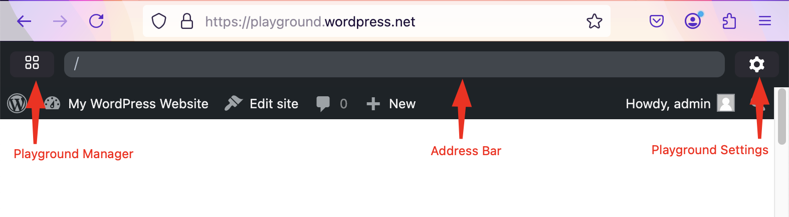

# WordPress Playground web instance

[https://playground.wordpress.net/](https://playground.wordpress.net/) is a versatile web tool that allows developers to run WordPress in a browser without needing a server. This environment is particularly useful for testing plugins, themes, and other WordPress features quickly and efficiently.

Key features:

-   **Browser-based**: No need for a local server setup.
-   **Instant Setup**: Run WordPress with a single click.
-   **Testing Environment**: Ideal for testing plugins and themes.

Via [Query Params](/developers/apis/query-api/) you can directly control the Playground instance. You can assign settings, like WordPress or PHP versions, plugins and theme to install or point to a configuration file called "Blueprint". (check [here](/quick-start-guide#try-a-block-a-theme-or-a-plugin) some examples).

The Playground interface consists of three key sections:

-   **Site Explorer**

-   **Workspace & Settings**

-   **Site Preview**

-   **Address Bar**

Upon clicking the **Playground Manager** icon you can view the following interface as shown in the screenshot below.

Each of these sections provides essential functionalities for managing the WordPress instance.

:::tip

You need to activate "Network access" to be able to browse for [plugins](https://w.org/plugins) and [themes](https://w.org/themes) from your WordPress instance.
:::

#

## 1. Site Explorer

The **Site Explorer** panel lets you control the overall Playground browser instance. It allows you to:

-   Manage multiple WordPress sites within the Playground instance.

-   Switch between saved sites and create new instances.

-   Access four key resource links:

    -   [Preview WordPress PR](https://playground.wordpress.net)
    -   [More demos](https://playground.wordpress.net/demos/index.html)
    -   [Documentation](https://wordpress.github.io/wordpress-playground/)
    -   [GitHub](https://github.com/wordpress/wordpress-playground)

-   Utilize the three-dot menu for additional options:

    -   Preview WordPress PR
    -   Preview Gutenberg PR
    -   Import from GitHub
    -   Import from Zip

## 2. Workspace & Settings

The **Workspace & Settings** displays the currently selected site. If you only have one site, it defaults to the **Temporary Playground**. If multiple sites are saved, this section updates based on the selected site from the **Site Explorer**.

The settings displayed here apply only to the active site and are not global Playground settings. The options include:

-   **WordPress Version:** Choose from the latest stable version, release candidates (RC), and older versions.

-   **PHP Version:** Select the PHP version for compatibility testing.

-   **Language:** Set the WordPress interface language.

-   **Network Access:** Enable or disable internet access for the site.

-   **Multisite Network:** Activate the multisite functionality to test networked sites.

### Temporary Playground Context

-   The first site in the Playground is always called the Temporary Playground by default.

-   When additional sites are created, the UI name changes according to the selected site.

-   Changes made in the **Temporary Playground** are lost upon page refresh.

-   Additional functionalities include:

    -   **Export to GitHub:** Save the current state of the Playground to a GitHub repository.

    -   **Download Site as .zip:** Export the WordPress instance as a zip file.

    -   **View Blueprint:** Check the configuration details of the Playground setup.

    -   **Report Error:** Submit an issue if something goes wrong.

## 3. Site Preview

The **Site Preview** is a full-screen display of the currently active WordPress instance. It allows users to interact with their WordPress setup in real-time.

-   The view automatically expands to full screen when selected.

-   Users can return to the other Playground sections using:

    -   The **left-side icon** to navigate back to the **Site Explorer**.

    -   The **right-side icon** to return to the **Workspace & Settings**.

## 4. Address Bar

The **Address Bar** displays the URL of the current WordPress instance running in Playground. It allows users to:

-   Copy and share the instance URL.

-   Modify query parameters for advanced debugging.

-   Reset the instance to its default state.

:::caution

The site at https://playground.wordpress.net is there to support the community, but there are no guarantees it will continue to work if the traffic grows significantly.

If you need certain availability, you should [host your own WordPress Playground](/developers/architecture/host-your-own-playground).
:::
